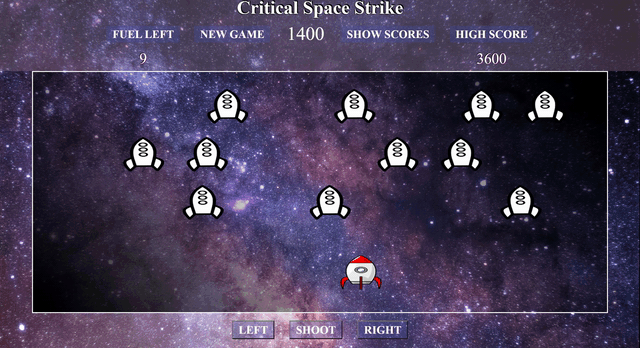
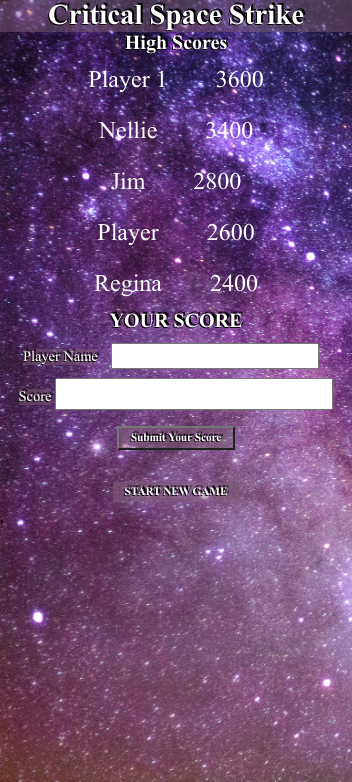

# Chingu Solo Project - Tier 3 - Critical Space Strike Game

# -WARNING- Before you take on this project, know that the frame rates, and animation process can produce effects similar to strobe lights, if you have any # # #sensitivity to these things, especially with seizures proceed with extreme caution. 
Also be aware of producing a strobe lighting effect as you create it, even if you are unaffected, this may hurt someone who plays your game. Strobe light effects should not be used in any way. Small bits of image flash are very common in animating, just be aware of bright lighting(coloring) that can simulate a flash during the process. [Strobe light on wikipedia](https://en.wikipedia.org/wiki/Strobe_light)

  

  

## Overview ##

This project is a great opportunity to develop a game. Critical Space Strike was developed as a tribute to old fashioned arcade games and provides an opportunity to exercise your HTML, CSS, and Javascript skills. Tier 3  also requires you to develop a backend with database integration.

**You May Use the Stack of Your Choice!**

## Instructions ##

Tier 3 **MUST** include a back-end to allow the player's name(optional) and score(required) to be added to the database. General instructions for all Pre-Work Projects can also be found in the Chingu Voyage Handbook (URL posted in the #read-me-first channel on Discord).

**Requirements**

*Structure*
- [ ] Header with title, player's score, a New Game button, a High Score, and a bar, some images, or a counter to keep track of player's life(fuel)
- [ ] Game display section with enemy objects and a player object must always be visible during game play
- [ ] Game display section must have at least 3 tiers of at least 5 enemy objects and a player object 
- [ ] Player shoot button which controls shooting animation
- [ ] Buttons which can control player movement
- [ ] A Form on which a player can submit their score to add to the list of high scores
- [ ] Highest five scores in database display with names of players or a default if no player name was submitted

*Style*
- [ ] Game should be mobile responsive across all device sizes
- [ ] Buttons/links should be evident
- [ ] Enemy ship tiers can be different colors or styles

*Functionality*
- [ ] Game display section must have at least 3 tiers of at least 5 enemy objects and a player object 
- [ ] Player object has at least left right movement controlled by buttons or direction keys but is restricted to a certain area which does not overlap enemy
- [ ] Enemy object tiers move as a tier but each tier moves differently in a restricted area which does not overlap other tiers or player object
- [ ] Enemy tiers move in a loop or repeating pattern
- [ ] Player and enemy animation should not interfere with each other
- [ ] Player Shoot button causes firing animation
- [ ] If enemy objects are hit they should disappear and the score should be incremented
- [ ] On load, the page can display enemy animation or wait for the New Game button to start
- [ ] Player firing should decrease player life(fuel) by some amount
- [ ] When player life or fuel is zero game should be over 
- [ ] Player should be given an opportunity to add name and score to high score list

*Other*
- [ ] Your repo needs to have a robust README.md
- [ ] Make sure that there are no errors in the developer console before submitting

  

  

  
**Extras (Not Required)**
- [ ] A game start screen
- [ ] Enemy fire which decreases player life 
- [ ] A black and white mode for increased visual accessability
